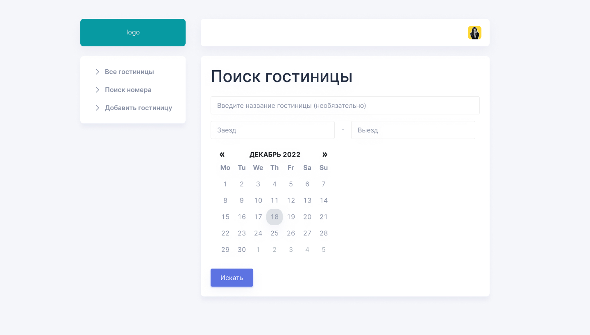
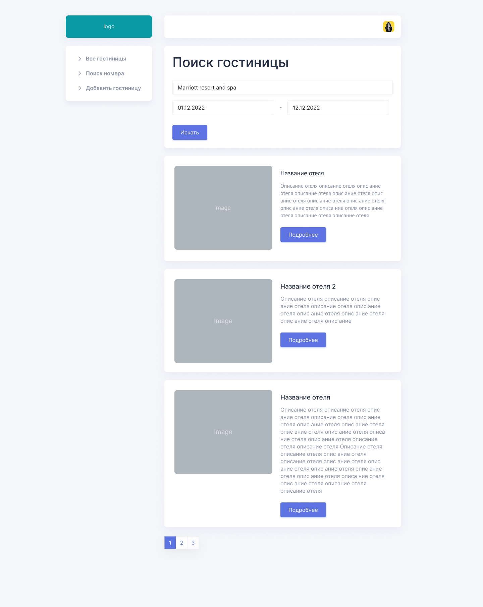
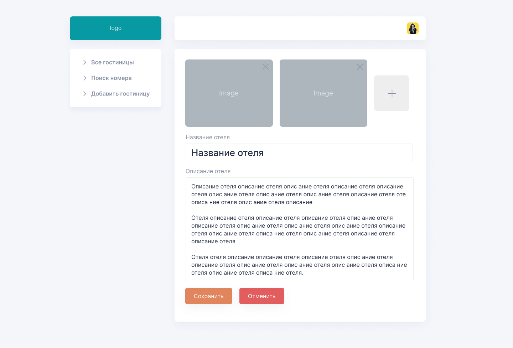
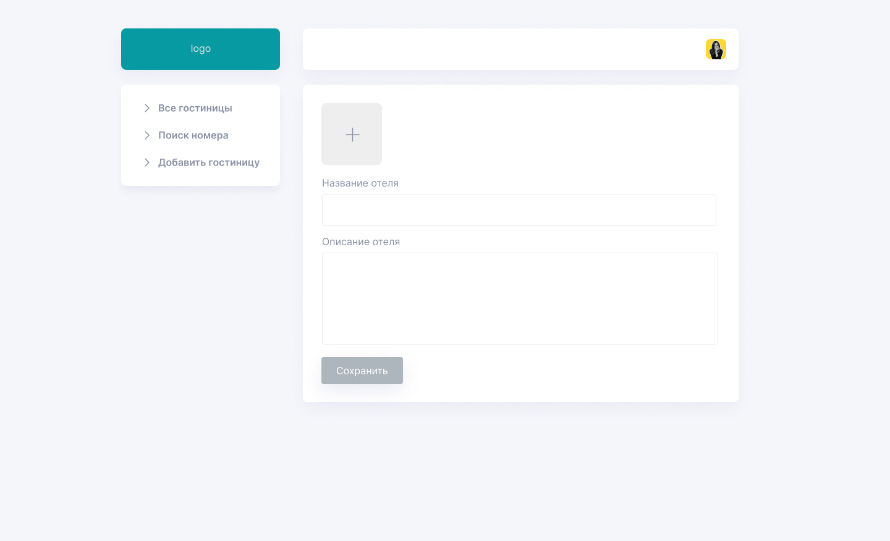
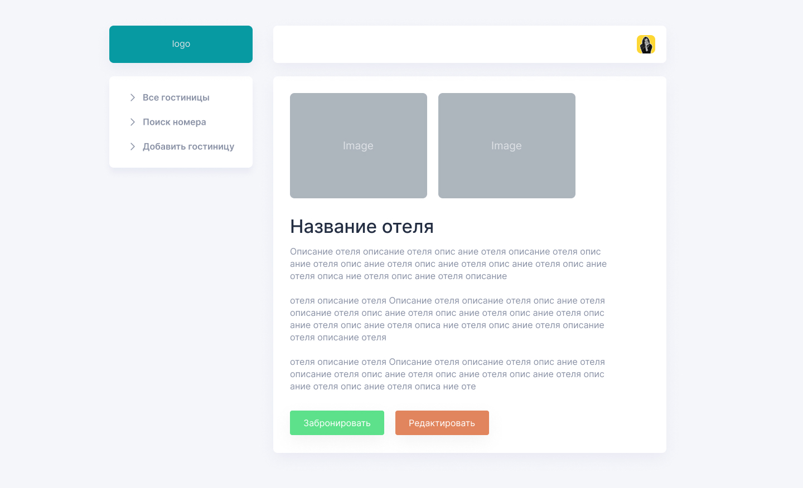

# Дипломный проект на курсе Fullstack-разработка на JavaScript»

## Описание проекта

Дипломный проект представляет собой сайт-агрегатор просмотра и бронирования гостиниц. Ваша задача заключается в разработке фронтенда и бэкенда для сайта-агрегатора с реализацией возможности бронирования гостиниц на диапазон дат.

## Цели проекта

1. Разработка публичного API.
2. Разработка API пользователя.
3. Разработка API администратора.
4. Разработка чата консультанта.

## Технологический стек

- React;
- Node.js;
- Nest.js;
- MongoDB;
- WebSocket.

## Допущения

Оплату бронирования реализовывать не нужно.

## ФРОНТЕНД

[Визуальная часть проекта](https://www.figma.com/file/O1k8p0I1HPilLiV9jPg8d2/%D0%94%D0%B8%D0%BF%D0%BB%D0%BE%D0%BC-Fullstack-%E2%80%94-Front-end?node-id=4%3A715&t=9bo3bYGMItLS7e0g-0)

## Кроссбраузерность

…

## Адаптивность

…

## Безопасность

Реализация защиты от XSS-атак
Безопасность передачи паролей

## БЭКЕНД

## Глоссарий

В документе приводятся описания разных интерфейсов и типов. Для упрощения описания в этом разделе приводятся общие типы.

```ts
type ID = string | ObjectId;
```

## 1. Описание базовых модулей

Базовые модули используются для описания бизнес-логики и хранения данных.

### 1.1. Модуль «Пользователи»

Модуль «Пользователи» предназначается для создания, хранения и поиска профилей пользователей.

Модуль «Пользователи» используется функциональными модулями для регистрации и аутентификации.

Данные пользователя должны храниться в MongoDB.

Модель данных `User` пользователя должна содержать поля:

| Название     |    Тип     | Обязательное | Уникальное | По умолчанию |
| ------------ | :--------: | :----------: | :--------: | :----------: |
| \_id         | `ObjectId` |      да      |     да     |              |
| email        |  `string`  |      да      |     да     |              |
| passwordHash |  `string`  |      да      |    нет     |              |
| name         |  `string`  |      да      |    нет     |              |
| contactPhone |  `string`  |     нет      |    нет     |              |
| role         |  `string`  |      да      |    нет     |   `client`   |

---

Модуль «Пользователи» должен быть реализован в виде NestJS-модуля и экспортировать сервисы с интерфейсами:

```ts
interface SearchUserParams {
  limit: number;
  offset: number;
  email: string;
  name: string;
  contactPhone: string;
}
interface IUserService {
  create(data: Partial<User>): Promise<User>;
  findById(id: ID): Promise<User>;
  findByEmail(email: string): Promise<User>;
  findAll(params: SearchUserParams): Promise<User[]>;
}
```

Поле `role` может принимать одно из значений:

- `client`,
- `admin`,
- `manager`.

При поиске `IUserService.findAll()` поля `email`, `name` и `contactPhone` должны проверяться на частичное совпадение.

### 1.2. Модуль «Гостиницы»

Модуль «Гостиницы» предназначается для хранения и поиска гостиниц и комнат.

Модуль «Гостиницы» используется функциональными модулями для показа списка мест для бронирования, а также для их добавления, включения и выключения.

Данные должны храниться в MongoDB.

Модель данных `Hotel` должна содержать поля:

| Название    |    Тип     | Обязательное | Уникальное | По умолчанию |
| ----------- | :--------: | :----------: | :--------: | :----------: |
| \_id        | `ObjectId` |      да      |     да     |              |
| title       | `ObjectId` |      да      |    нет     |              |
| description |  `string`  |     нет      |    нет     |              |
| createdAt   |   `Date`   |      да      |    нет     |              |
| updatedAt   |   `Date`   |      да      |    нет     |              |

Модель данных `HotelRoom` должна содержать поля:

| Название    |    Тип     | Обязательное | Уникальное | По умолчанию |
| ----------- | :--------: | :----------: | :--------: | :----------: |
| \_id        | `ObjectId` |      да      |     да     |              |
| hotel       | `ObjectId` |      да      |    нет     |              |
| description |  `string`  |     нет      |    нет     |              |
| images      | `string[]` |     нет      |    нет     |     `[]`     |
| createdAt   |   `Date`   |      да      |    нет     |              |
| updatedAt   |   `Date`   |      да      |    нет     |              |
| isEnabled   | `boolean`  |      да      |    нет     |    `true`    |

Свойство `hotel` должно [ссылаться](https://mongoosejs.com/docs/populate.html) на модель `Hotel`.

---

Модуль «Гостиницы» должен быть реализован в виде NestJS-модуля и экспортировать сервисы с интерфейсами:

```ts
interface SearchHotelParams {
  limit: number;
  offset: number;
  title: string;
}

interface UpdateHotelParams {
  title: string;
  description: string;
}

interface IHotelService {
  create(data: any): Promise<Hotel>;
  findById(id: ID): Promise<Hotel>;
  search(params: SearchHotelParams): Promise<Hotel[]>;
  update(id: ID, data: UpdateHotelParams): Promise<Hotel>;
}

interface SearchRoomsParams {
  limit: number;
  offset: number;
  hotel: ID;
  isEnabled?: boolean;
}

interface HotelRoomService {
  create(data: Partial<HotelRoom>): Promise<HotelRoom>;
  findById(id: ID): Promise<HotelRoom>;
  search(params: SearchRoomsParams): Promise<HotelRoom[]>;
  update(id: ID, data: Partial<HotelRoom>): Promise<HotelRoom>;
}
```

В методе `search` флаг `isEnabled` может принимать только boolean значения или может быть не передан, тогда должны вернутся все записи:

- `true` — флаг должен использоваться в фильтрации;
- `undefined` — если не передан параметр, флаг должен игнорироваться.

### 1.3. Модуль «Брони»

Модуль «Брони» предназначен для хранения и получения броней гостиниц конкретного пользователя.

Модуль «Брони» **не должен** использовать модуль «Пользователи» и модуль «Гостиницы» для получения данных.

Модуль «Брони» **не должен** хранить данные пользователей и гостиниц.

Модуль «Брони» **должен** использовать соединение с базой данных.

Данные должны храниться в MongoDB.

Модель данных `Reservation` должна содержать поля:

| Название  |    Тип     | Обязательное | Уникальное | По умолчанию |
| --------- | :--------: | :----------: | :--------: | :----------: |
| \_id      | `ObjectId` |      да      |     да     |              |
| userId    | `ObjectId` |      да      |    нет     |              |
| hotelId   | `ObjectId` |      да      |    нет     |              |
| roomId    | `ObjectId` |      да      |    нет     |              |
| dateStart |   `Date`   |      да      |    нет     |              |
| dateEnd   |   `Date`   |      да      |    нет     |              |

---

Модуль «Брони» должен быть реализован в виде NestJS-модуля и экспортировать сервисы с интерфейсами:

```ts
interface ReservationDto {
  userId: ID;
  hotelId: ID;
  roomId: ID;
  dateStart: Date;
  dateEnd: Date;
}

interface ReservationSearchOptions {
  userId: ID;
  dateStart: Date;
  dateEnd: Date;
}
interface IReservation {
  addReservation(data: ReservationDto): Promise<Reservation>;
  removeReservation(id: ID): Promise<void>;
  getReservations(
    filter: ReservationSearchOptions
  ): Promise<Array<Reservation>>;
}
```

Метод `IReservation.addReservation` должен проверять, доступен ли номер на заданную дату.

### 1.4. Модуль «Чат техподдержки»

Модуль «Чат техподдержки» предназначается для хранения обращений в техподдержку и сообщений в чате обращения.

Модуль «Чат техподдержки» используется функциональными модулями для реализации возможности общения пользователей с поддержкой.

Данные чатов должны храниться в MongoDB.

Модель данных чата `SupportRequest` должна содержать поля:

| Название  |     Тип     | Обязательное | Уникальное |
| --------- | :---------: | :----------: | :--------: |
| \_id      | `ObjectId`  |      да      |     да     |
| user      | `ObjectId`  |      да      |    нет     |
| createdAt |   `Date`    |      да      |    нет     |
| messages  | `Message[]` |     нет      |    нет     |
| isActive  |   `bool`    |     нет      |    нет     |

Модель сообщения `Message` должна содержать поля:

| Название |    Тип     | Обязательное | Уникальное |
| -------- | :--------: | :----------: | :--------: |
| \_id     | `ObjectId` |      да      |     да     |
| author   | `ObjectId` |      да      |    нет     |
| sentAt   |   `Date`   |      да      |    нет     |
| text     |  `string`  |      да      |    нет     |
| readAt   |   `Date`   |     нет      |    нет     |

Сообщение считается прочитанным, когда поле `readAt` не пустое.

---

Модуль «Чат техподдержки» должен быть реализован в виде NestJS-модуля и должен экспортировать сервисы с интерфейсами:

```ts
interface CreateSupportRequestDto {
  user: ID;
  text: string;
}

interface SendMessageDto {
  author: ID;
  supportRequest: ID;
  text: string;
}
interface MarkMessagesAsReadDto {
  user: ID;
  supportRequest: ID;
  createdBefore: Date;
}

interface GetChatListParams {
  user: ID | null;
  isActive: bool;
}

interface ISupportRequestService {
  findSupportRequests(params: GetChatListParams): Promise<SupportRequest[]>;
  sendMessage(data: SendMessageDto): Promise<Message>;
  getMessages(supportRequest: ID): Promise<Message[]>;
  subscribe(
    handler: (supportRequest: SupportRequest, message: Message) => void
  ): () => void;
}

interface ISupportRequestClientService {
  createSupportRequest(data: CreateSupportRequestDto): Promise<SupportRequest>;
  markMessagesAsRead(params: MarkMessagesAsReadDto);
  getUnreadCount(supportRequest: ID): Promise<Message[]>;
}

interface ISupportRequestEmployeeService {
  markMessagesAsRead(params: MarkMessagesAsReadDto);
  getUnreadCount(supportRequest: ID): Promise<Message[]>;
  closeRequest(supportRequest: ID): Promise<void>;
}
```

---

1. Метод `ISupportRequestClientService.getUnreadCount` должен возвращать количество сообщений, которые были отправлены любым сотрудником поддержки и не отмечены прочитанным.
2. Метод `ISupportRequestClientService.markMessagesAsRead` должен выставлять текущую дату в поле readAt всем сообщениям, которые не были прочитаны и были отправлены не пользователем.
3. Метод `ISupportRequestEmployeeService.getUnreadCount` должен возвращать количество сообщений, которые были отправлены пользователем и не отмечены прочитанными.
4. Метод `ISupportRequestEmployeeService.markMessagesAsRead` должен выставлять текущую дату в поле readAt всем сообщениям, которые не были прочитаны и были отправлены пользователем.
5. Метод `ISupportRequestEmployeeService.closeRequest` должен менять флаг `isActive` на `false`.
6. Оповещения должны быть реализованы через механизм `EventEmitter`.

## 2. Описание модулей WEB API

## 2.1. API Модуля «Гостиницы»

Бэкенд должен быть оформлен в виде отдельного NestJS-модуля.

### **Ограничения**

Если пользователь не аутентифицирован или его роль `client`, то при поиске всегда должен использоваться флаг `isEnabled: true`.

### **2.1.1. Поиск номеров**

#### **Описание**

Поиск номеров:



Обязательные поля:
- Заезд
- Выезд
Валидация на клиенте.

Выдача результатов поиска:



На одной странице отображается 10 отелей. Если найдено менее 10 отелей, пагинация не отображается. При переходе на следующую страницу пагинации, происходит прокрутка вверх к первому результату.

Карточка гостиницы: 
Отображается первое фото гостиницы.
Кнопка Подробнее ведет на страницу отеля.

Основной API для поиска номеров.

#### **Адрес**

```http
GET /api/common/hotel-rooms
```

#### **Query-параметры**

- limit — количество записей в ответе;
- offset — сдвиг от начала списка;
- hotel — ID гостиницы для фильтра.

#### **Формат ответа**

```json
[
  {
    "id": string,
    "description": string,
    "images": [string],
    "hotel": {
      "id": string,
      "title": string
    }
  }
]
```

#### **Доступ**

Доступно всем пользователям, включая неаутентифицированных.

### **2.1.2. Информация о конкретном номере**

#### **Описание**

Получение подробной информации о номере.

#### **Адрес**

```http
GET /api/common/hotel-rooms/:id
```

#### **Query-параметры**

Отсутствуют.

#### **Формат ответа**

```json
{
  "id": string,
  "description": string,
  "images": [string],
  "hotel": {
    "id": string,
    "title": string,
    "description": string
  }
}
```

#### **Доступ**

Доступно всем пользователям, включая неаутентифицированных.

### **2.1.3. Добавление гостиницы**

#### **Описание**

Добавление гостиницы администратором.

#### **Адрес**

```http
POST /api/admin/hotels/
```

#### **Body-параметры**

```json
{
  "title": string,
  "description": string
}
```

#### **Формат ответа**

```json
{
  "id": string,
  "title": string,
  "description": string
}
```

#### **Доступ**

Доступно только аутентифицированным пользователям с ролью `admin`.

#### **Ошибки**

- `401` - если пользователь не аутентифицирован;
- `403` - если роль пользователя не `admin`.

### **2.1.4. Получение списка гостиниц**

#### **Описание**

Получение списка гостиниц администратором.

#### **Адрес**

```http
GET /api/admin/hotels/
```

#### **Query-параметры**

- limit - количество записей в ответе;
- offset - сдвиг от начала списка.

#### **Формат ответа**

```json
{
  "id": string,
  "title": string,
  "description": string
}
```

#### **Доступ**

Доступно только аутентифицированным пользователям с ролью `admin`.

#### **Ошибки**

- `401` - если пользователь не аутентифицирован;
- `403` - если роль пользователя не `admin`.

### **2.1.5. Изменение описания гостиницы**

#### **Описание**

Изменение описания гостиницы администратором.

Страница редактирования гостиницы заполненная:



Изображения можно менять местами перетаскиванием. Перетаскивание меняет порядок отображения на странице гостиницы.
Кнопка добавления фото после добавления 10 фото исчезает. Любое добавленное фото можно удалить. Превью фото должно быть оптимизировано по размеру превью. По клику на добавленное фото, в модальном окне отображается полноразмерное фото.
Клик по кнопке Сохранить приводит к возврату на страницу гостиницы.
Клик по кнопке Отменить приводит к возврату на страницу гостиницы.

Страница редактирования гостиницы пустая:



Обязательные поля: 
Фото (минимум одно, максимум 10), максимальный объем 10Мб, минимальная ширина фото 1000пикселей, максимальный размер фото 5000 пикселей по любой из сторон, допустимые форматы: png, jpg, jpeg, webp
Название (минимум 5 символов)
Описание (минимум 100 символов)

Кнопке Сохранить до прохождения валидации присвоено состояние disabled

Страница гостиницы:



Клик по кнопке Редактировать приводит к переходу на страницу редактирования гостиницы.
Высота изображений одинакова, даже если загружены фото разной высоты. Ширина подстраивается.

#### **Адрес**

```http
PUT /api/admin/hotels/:id
```

#### **Body-параметры**

```json
{
  "title": string,
  "description": string
}
```

#### **Формат ответа**

```json
{
  "id": string,
  "title": string,
  "description": string
}
```

#### **Доступ**

Доступно только аутентифицированным пользователям с ролью `admin`.

#### **Ошибки**

- `401` - если пользователь не аутентифицирован;
- `403` - если роль пользователя не `admin`.

### **2.1.6. Добавление номера**

#### **Описание**

Добавление номера гостиницы администратором.

#### **Адрес**

```http
POST /api/admin/hotel-rooms/
```

#### **Body-параметры**

Этот запрос предполагает загрузку файлов и должен использовать формат `multipart/form-data`.

```form-data
description: string
hotelId: string
images[]: File
```

#### **Формат ответа**

```json
{
  "id": string,
  "description": string,
  "images": [string],
  "isEnabled": boolean,
  "hotel": {
    "id": string,
    "title": string,
    "description": string
  }
}
```

#### **Доступ**

Доступно только аутентифицированным пользователям с ролью `admin`.

#### **Ошибки**

- `401` - если пользователь не аутентифицирован;
- `403` - если роль пользователя не `admin`.

### **2.1.7. Изменение описания номера**

#### **Описание**

Изменение описания номера гостиницы администратором.

#### **Адрес**

```http
PUT /api/admin/hotel-rooms/:id
```

#### **Body-параметры**

Этот запрос предполагает загрузку файлов и дожен использовать формат `multipart/form-data`.

```form-data
description: string
hotelId: string
isEnabled: boolean
images[]: File | string
```

При обновлении может быть отправлен одновременно список ссылок на уже загруженные картинки и список файлов с новыми картинками.

При использовании [`multer`](https://docs.nestjs.com/techniques/file-upload) список загруженных файлов можно получить через `@UploadedFiles()`. Этот список нужно объединить со списком, который пришёл в `body`.

#### **Формат ответа**

```json
{
  "id": string,
  "description": string,
  "images": [string],
  "isEnabled": boolean,
  "hotel": {
    "id": string,
    "title": string,
    "description": string
  }
}
```

#### **Доступ**

Доступно только аутентифицированным пользователям с ролью `admin`.

#### **Ошибки**

- `401` - если пользователь не аутентифицирован;
- `403` - если роль пользователя не `admin`.

### 2.2. API Модуля «Бронирование»

Должно быть оформлено в виде отдельного NestJS-модуля.

### **2.2.1. Бронирование номера клиентом**

#### **Описание**

Создаёт бронь на номер на выбранную дату для текущего пользователя.

#### **Адрес**

```http
POST /api/client/reservations
```

#### **Body-параметры**

```json
{
  "hotelRoom": string,
  "startDate": string,
  "endDate": string
}
```

#### **Формат ответа**

```json
{
  "startDate": string,
  "endDate": string,
  "hotelRoom": {
    "description": string,
    "images": [string]
  },
  "hotel": {
    "title": string,
    "description": string
  }
}
```

#### **Доступ**

Доступно только аутентифицированным пользователям с ролью `client`.

#### **Ошибки**

- `401` - если пользователь не аутентифицирован;
- `403` - если роль пользователя не `client`;
- `400` - если номера с указанным ID не существует или он отключён.

### **2.2.2. Список броней текущего пользователя**

#### **Описание**

Список броней текущего пользователя.

#### **Адрес**

```http
GET /api/client/reservations
```

#### **Формат ответа**

```json
[
  {
    "startDate": string,
    "endDate": string,
    "hotelRoom": {
      "description": string,
      "images": [string]
    },
    "hotel": {
      "title": string,
      "description": string
    }
  }
]
```

#### **Доступ**

Доступно только аутентифицированным пользователям с ролью `client`.

#### **Ошибки**

- `401` - если пользователь не аутентифицирован;
- `403` - если роль пользователя не `client`.

### **2.2.3. Отмена бронирования клиентом**

#### **Описание**

Отменяет бронь пользователя.

#### **Адрес**

```http
DELETE /api/client/reservations/:id
```

#### **Формат ответа**

Пустой ответ.

#### **Доступ**

Доступно только аутентифицированным пользователям с ролью `client`.

#### **Ошибки**

- `401` - если пользователь не аутентифицирован;
- `403` - если роль пользователя не `client`;
- `403` - если `ID` текущего пользователя не совпадает с `ID` пользователя в брони;
- `400` - если брони с указанным ID не существует.

### **2.2.4. Список броней конкретного пользователя**

#### **Описание**

Список броней конкретного пользователя.

#### **Адрес**

```http
GET /api/manager/reservations/:userId
```

#### **Формат ответа**

```json
[
  {
    "startDate": string,
    "endDate": string,
    "hotelRoom": {
      "description": string,
      "images": [string]
    },
    "hotel": {
      "title": string,
      "description": string
    }
  }
]
```

#### **Доступ**

Доступно только аутентифицированным пользователям с ролью `manager`.

#### **Ошибки**

- `401` - если пользователь не аутентифицирован;
- `403` - если роль пользователя не `manager`.

### **2.2.5. Отмена бронирования менеджером**

#### **Описание**

Отменяет бронь пользователя по id брони.

#### **Адрес**

```http
DELETE /api/manager/reservations/:id
```

#### **Формат ответа**

Пустой ответ.

#### **Доступ**

Доступно только аутентифицированным пользователям с ролью `manager`.

#### **Ошибки**

- `401` - если пользователь не аутентифицирован;
- `403` - если роль пользователя не `manager`;
- `400` - если брони с указанным ID не существует.

## 2.3. API Модуля «Аутентификация и авторизация»

Должно быть оформлено в виде отдельного NestJS-модуля.

Модуль «Аутентификация и авторизация» предназначен для:

- управления сессией пользователя,
- регистрации пользователей.

Хранение сессии должно реализовываться посредством библиотеки passport.js с хранением сессии в памяти приложения.

Аутентификация пользователя производится с помощью модуля «Пользователи». Каждому пользователю назначается одна из ролей - клиент, администратор, консультант.

### **2.3.1. Вход**

#### **Описание**

Стартует сессию пользователя и выставляет Cookies.

#### **Адрес**

```http
POST /api/auth/login
```

#### **Body-параметры**

```json
{
  "email": string,
  "password": string
}
```

#### **Формат ответа**

```json
{
  "email": string,
  "name": string,
  "contactPhone": string
}
```

#### **Доступ**

Доступно только не аутентифицированным пользователям.

#### **Ошибки**

- `401` - если пользователя с указанным email не существует или пароль неверный.

### **2.3.2. Выход**

#### **Описание**

Завершает сессию пользователя и удаляет Cookies.

#### **Адрес**

```http
POST /api/auth/logout
```

#### **Формат ответа**

Пустой ответ.

#### **Доступ**

Доступно только аутентифицированным пользователям.

### **2.3.3. Регистрация**

#### **Описание**

Позволяет создать пользователя с ролью `client` в системе.

#### **Адрес**

```http
POST /api/client/register
```

#### **Body-параметры**

```json
{
  "email": string,
  "password": string,
  "name": string,
  "contactPhone": string
}
```

#### **Формат ответа**

```json
{
  "id": string,
  "email": string,
  "name": string
}
```

#### **Доступ**

Доступно только не аутентифицированным пользователям.

#### **Ошибки**

- `400` - если email уже занят.

## 2.4. API Модуля «Управление пользователями»

### **2.4.1. Создание пользователя**

#### **Описание**

Позволяет пользователю с ролью `admin` создать пользователя в системе.

#### **Адрес**

```http
POST /api/admin/users/
```

#### **Body-параметры**

```json
{
  "email": string,
  "password": string,
  "name": string,
  "contactPhone": string,
  "role": string
}
```

#### **Формат ответа**

```json
{
  "id": string,
  "email": string,
  "name": string,
  "contactPhone": string,
  "role": string
}
```

#### **Доступ**

Доступно только пользователям с ролью `admin`.

#### **Ошибки**

- `401` - если пользователь не аутентифицирован;
- `403` - если роль пользователя не `admin`.

### **2.4.2. Получение списка пользователей**

#### **Описание**

Позволяет пользователю с ролью `admin` создать пользователя в системе.

#### **Адрес**

```http
GET /api/admin/users/
GET /api/manager/users/
```

#### **Query-параметры**

- limit - количество записей в ответе;
- offset - сдвиг от начала списка;
- name - фильтр по полю;
- email - фильтр по полю;
- contactPhone - фильтр по полю.

#### **Формат ответа**

```json
[
  {
    "id": string,
    "email": string,
    "name": string,
    "contactPhone": string
  }
]
```

#### **Доступ**

```http
GET /api/admin/users/
```

Доступно только пользователям с ролью `admin`.

```http
GET /api/manager/users/
```

Доступно только пользователям с ролью `manager`.

#### **Ошибки**

- `401` - если пользователь не аутентифицирован;
- `403` - если роль пользователя не подходит.

## 2.5. API модуля «Чат с техподдрежкой»

### **2.5.1. Создание обращения в поддержку**

#### **Описание**

Позволяет пользователю с ролью `client` создать обращение в техподдержку.

#### **Адрес**

```http
POST /api/client/support-requests/
```

#### **Body-параметры**

```json
{
  "text": string
}
```

#### **Формат ответа**

```json
[
  {
    "id": string,
    "createdAt": string,
    "isActive": boolean,
    "hasNewMessages": boolean
  }
]
```

#### **Доступ**

Доступно только пользователям с ролью `client`.

#### **Ошибки**

- `401` - если пользователь не аутентифицирован;
- `403` - если роль пользователя не подходит.

### **2.5.2. Получение списка обращений в поддержку для клиента**

#### **Описание**

Позволяет пользователю с ролью `client` получить список обращений для текущего пользователя.

#### **Адрес**

```http
GET /api/client/support-requests/
```

#### **Query-параметры**

- limit - количество записей в ответе;
- offset - сдвиг от начала списка;
- isActive - фильтр по полю.

#### **Формат ответа**

```json
[
  {
    "id": string,
    "createdAt": string,
    "isActive": boolean,
    "hasNewMessages": boolean
  }
]
```

#### **Доступ**

Доступно только пользователям с ролью `client`.

#### **Ошибки**

- `401` - если пользователь не аутентифицирован;
- `403` - если роль пользователя не подходит.

### **2.5.3. Получение списка обращений в поддержку для менеджера**

#### **Описание**

Позволяет пользователю с ролью `manager` получить список обращений от клиентов.

#### **Адрес**

```http
GET /api/manager/support-requests/
```

#### **Query-параметры**

- limit - количество записей в ответе;
- offset - сдвиг от начала списка;
- isActive - фильтр по полю.

#### **Формат ответа**

```json
[
  {
    "id": string,
    "createdAt": string,
    "isActive": boolean,
    "hasNewMessages": boolean,
    "client": {
      "id": string,
      "name": string,
      "email": string,
      "contactPhone": string
    }
  }
]
```

#### **Доступ**

Доступно только пользователям с ролью `manager`.

#### **Ошибки**

- `401` - если пользователь не аутентифицирован;
- `403` - если роль пользователя не подходит.

### **2.5.4. Получение истории сообщений из обращения в техподдержку**

#### **Описание**

Позволяет пользователю с ролью `manager` или `client` получить все сообщения из чата.

#### **Адрес**

```http
GET /api/common/support-requests/:id/messages
```

#### **Формат ответа**

```json
[
  {
    "id": string,
    "createdAt": string,
    "text": string,
    "readAt": string,
    "author": {
      "id": string,
      "name": string
    }
  }
]
```

#### **Доступ**

Доступно только пользователям с ролью `manager` и пользователю с ролью `client`, который создал обращение.

#### **Ошибки**

- `401` - если пользователь не аутентифицирован;
- `403` - если роль пользователя не подходит.

### **2.5.5. Отправка сообщения**

#### **Описание**

Позволяет пользователю с ролью `manager` или `client` отправлять сообщения в чат.

#### **Адрес**

```http
POST /api/common/support-requests/:id/messages
```

#### **Body-параметры**

```json
{
  "text": string
}
```

#### **Формат ответа**

```json
[
  {
    "id": string,
    "createdAt": string,
    "text": string,
    "readAt": string,
    "author": {
      "id": string,
      "name": string
    }
  }
]
```

#### **Доступ**

Доступно только пользователям с ролью `manager` и пользователю с ролью `client`, который создал обращение.

#### **Ошибки**

- `401` - если пользователь не аутентифицирован;
- `403` - если роль пользователя не подходит.

### **2.5.6. Отправка события, что сообщения прочитаны**

#### **Описание**

Позволяет пользователю с ролью `manager` или `client` отправлять отметку, что сообщения прочитаны.

#### **Адрес**

```http
POST /api/common/support-requests/:id/messages/read
```

#### **Body-параметры**

```json
{
  "createdBefore": string
}
```

#### **Формат ответа**

```json
{
  "success": true
}
```

#### **Доступ**

Доступно только пользователям с ролью `manager` и пользователю с ролью `client`, который создал обращение.

#### **Ошибки**

- `401` - если пользователь не аутентифицирован;
- `403` - если роль пользователя не подходит.

### **2.5.7. Подписка на сообщения из чата техподдержки**

#### **Описание**

Позволяет пользователю с ролью `manager` или `client` получать новые сообщения в чате через WebSocket.

#### **Команда**

message: subscribeToChat
payload: chatId

#### **Формат ответа**

```json
{
  "id": string,
  "createdAt": string,
  "text": string,
  "readAt": string,
  "author": {
    "id": string,
    "name": string
  }
}
```

#### **Доступ**

Доступно только пользователям с ролью `manager` и пользователю с ролью `client`, который создал обращение.

## Запуск приложения

Для запуска приложения в корне проекта должны находиться следующие файлы:

- `package.json` и `package-lock.json` с описанными зависимостями,
- `Dockerfile` для сборки образа приложения,
- `docker-compose.yaml` с сервисом приложения и сервисом MondoDB,
- `README.me` с описанием проекта и вариантами его запуска.

Настройка параметров приложения должна производиться через переменные окружения. Это требование как для запуска в окружении хоста, так и при работе с Docker.

Список переменных окружения должен быть описан в файле `.env-example`. Этот файл не должен содержать значений. Пример файла:

```bash
HTTP_HOST=
HTTP_PORT=
MONGO_URL=
```

Для запуска приложения должен использоваться скрипт `npm start`, описанный в `package.json`.

## Как задавать вопросы руководителю по дипломной работе

1. Если у вас возник вопрос, попробуйте сначала самостоятельно найти ответ в интернете. Навык поиска информации пригодится вам в любой профессиональной деятельности. Если ответ не нашёлся, можно уточнить у руководителя по дипломной работе.
2. Если у вас набирается несколько вопросов, присылайте их в виде нумерованного списка. Так дипломному руководителю будет проще отвечать на каждый из них.
3. Для лучшего понимания контекста прикрепите к вопросу скриншоты и стрелкой укажите, что именно вызывает вопрос. Программу для создания скриншотов можно скачать [по ссылке](https://app.prntscr.com/ru/).
4. По возможности задавайте вопросы в комментариях к коду.
5. Формулируйте свои вопросы чётко, дополняя их деталями. На сообщения «Ничего не работает», «Всё сломалось» дипломный руководитель не сможет дать комментарии без дополнительных уточнений. Это затянет процесс получения ответа. 
6. Постарайтесь набраться терпения в ожидании ответа на свои вопросы. Дипломные руководители Нетологии – практикующие разработчики, поэтому они не всегда могут отвечать моментально. Зато их практика даёт возможность делиться с вами не только теорией, но и ценным прикладным опытом.  

Рекомендации по работе над дипломом:

1. Не откладывайте надолго начало работы над дипломом. В таком случае у вас останется больше времени на получение рекомендаций от руководителя и доработку диплома.
2. Разбейте работу над дипломом на части и выполняйте их поочерёдно. Вы будете успевать учитывать комментарии от руководителя и не терять мотивацию на полпути. 
